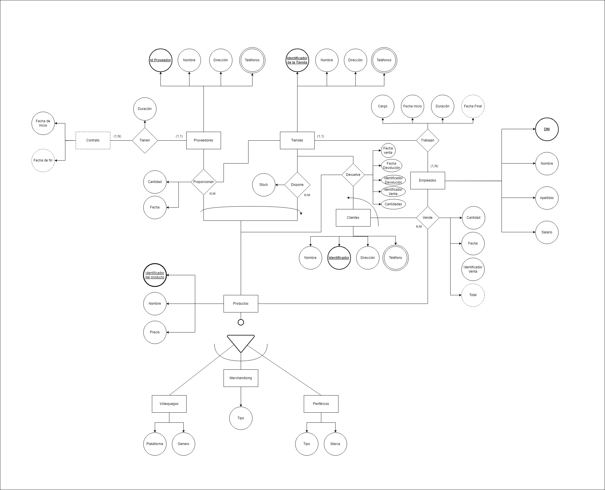
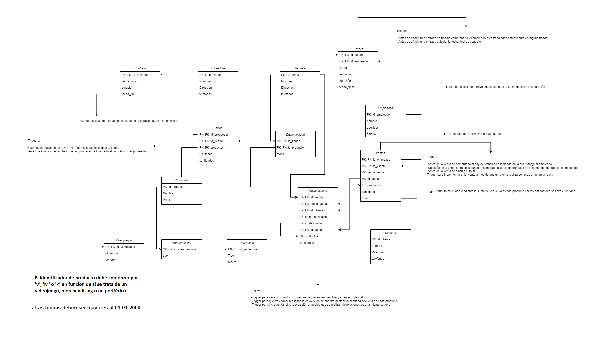

# Proyecto Final ADBD

> [!IMPORTANT]
> El archivo [tablas_base_de_datos](tablas_base_de_datos.sql) contiene el script para crear la base de datos, las tablas y los triggers necesarios.
> Despues de ejecutarlo con
> ```psql
> \i tablas_base_de_datos.sql
> ```
> debemos ejecutar [inserciones](inserciones.sql) con
>  ```psql
> \i inserciones.sql
>  ```
>  para realizar la carga inicial de datos
>
> Para iniciar la API debemos ejecutar lo siguiente
> ```bash
> flask --app app run --host 0.0.0.0 --port=8080
> ```
> esto ejecutará el [código](app.py)

## Modelo Entidad Relación



## Modelo Relacional


