# Proyecto Final ADBD
## Integrantes
- Gabriel Jonay Vera Estévez
- Muhammad Campos Preira
- Daniel González de Chaves González

> [!IMPORTANT]
> El archivo [tablas_base_de_datos](tablas_base_de_datos.sql) contiene el script para crear la base de datos, las tablas y los triggers necesarios.
> Despues de ejecutarlo con
> ```psql
> \i tablas_base_de_datos.sql
> ```
> debemos ejecutar [inserciones](inserciones.sql) con
>  ```psql
> \i inserciones.sql
>  ```
>  para realizar la carga inicial de datos
>
> Para iniciar la API debemos ejecutar lo siguiente
> ```bash
> flask --app app run --host 0.0.0.0 --port=8080
> ```
> esto ejecutará el [código](app.py)

> [!NOTE]
> 
> En este [vídeo](https://www.youtube.com/watch?v=yOu4f1kMP2Q) está la explicación en inglés.

## Modelo Entidad Relación


## Modelo Relacional

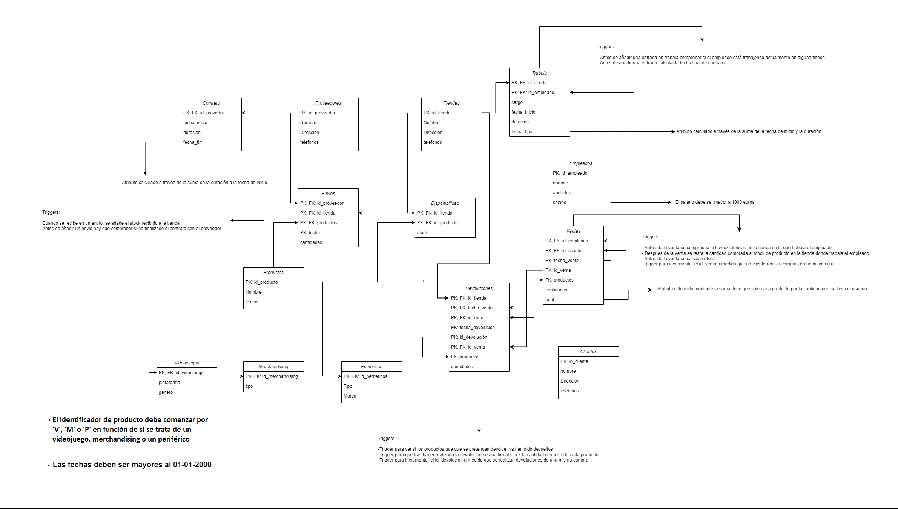

## Consultas de ejemplo

### Consulta 1

Cuando hacemos una inserción en la tabla devoluciones no pasamos ni el id ni la fecha de devolución, pero tras insertar se completa automáticamente.

    
```sql
INSERT INTO Devoluciones (id_tienda, fecha_venta, id_cliente, id_venta, productos, cantidades) VALUES ('TIENDA1', '2023-12-16', 45000000, 1, ARRAY['VLOL1', 'MCAM1'], ARRAY[1, 1]);

INSERT INTO Devoluciones (id_tienda, fecha_venta, id_cliente, id_venta, productos, cantidades) VALUES ('TIENDA2', '2023-12-16', 45000001, 2, ARRAY['PMOU1'], ARRAY[1]);

INSERT INTO Devoluciones (id_tienda, fecha_venta, id_cliente, id_venta, productos, cantidades) VALUES ('TIENDA2', '2023-12-16', 45000001, 2, ARRAY['PMOU1'], ARRAY[1]);
```

Tabla Devoluciones resultante tras las inserciones:

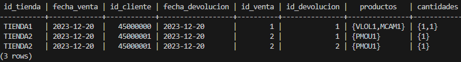

### Consulta 2

Cuando hacemos una inserción en la tabla ventas no pasamos el id, fecha ni total de la venta, pero tras insertar se completa automáticamente.

```sql
INSERT INTO Ventas (id_empleado, id_cliente, productos, cantidades) VALUES (99999999, 45000000, ARRAY['VLOL1', 'MCAM1'], ARRAY[1, 1]);

INSERT INTO Ventas (id_empleado, id_cliente, productos, cantidades) VALUES (99999998, 45000001, ARRAY['PMOU1'], ARRAY[2]);

INSERT INTO Ventas (id_empleado, id_cliente, productos, cantidades) VALUES (99999998, 45000001, ARRAY['PMOU1'], ARRAY[2]);
```

Tabla Ventas resultante tras las inserciones:

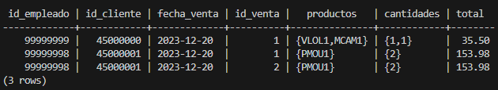

### Consulta 3

Tras envío:

```sql
INSERT INTO Envios (id_proveedor, id_tienda, productos, fecha, cantidades) VALUES ('PROV1', 'TIENDA1', ARRAY['VLOL1', 'MCAM1'], '2021-01-01', ARRAY[10, 10]);
```	

Tabla tras el envío:


Antes venta (verificar si hay producto suficiente):

```sql
INSERT INTO Ventas (id_empleado, id_cliente, productos, cantidades) VALUES (99999999, 45000000, ARRAY['VLOL1', 'MCAM1'], ARRAY[5, 25]);
```

Error producido al tratar de vender más cantidad del producto de la que tenemos en stock:


Si se intenta vender un producto que no existe en la tienda también da error:

```sql
INSERT INTO Ventas (id_empleado, id_cliente, productos, cantidades) VALUES (99999999, 45000000, ARRAY['VElDelAnillo'], ARRAY[25]);
```	

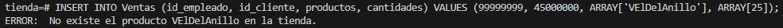

Después de una venta:

```sql
INSERT INTO Ventas (id_empleado, id_cliente, productos, cantidades) VALUES (99999999, 45000000, ARRAY['VLOL1', 'MCAM1'], ARRAY[20, 20]);
```

Tabla tras la venta:

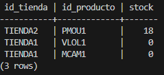

Después de una devolución:

```sql
INSERT INTO Devoluciones (id_tienda, fecha_venta, id_cliente, id_venta, productos, cantidades) VALUES ('TIENDA2', '2023-12-20', 45000000, 2, ARRAY['VLOL1', 'MCAM1'], ARRAY[3, 3]);
```

Tabla tras la devolución:

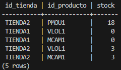

```sql
INSERT INTO Devoluciones (id_tienda, fecha_venta, id_cliente, id_venta, productos, cantidades) VALUES ('TIENDA2', '2023-12-20', 45000000, 2, ARRAY['VLOL1', 'MCAM1'], ARRAY[18, 18]);
```

Error obtenido al tratar de devolver una cantidad mayor a la comprada para cada producto:

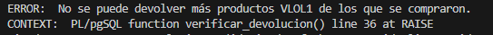


```sql
INSERT INTO Devoluciones (id_tienda, fecha_venta, id_cliente, id_venta, productos, cantidades) VALUES ('TIENDA2', '2023-12-20', 45000000, 1, ARRAY['VLOL2', 'MCAM1'], ARRAY[3, 3]);
```

Error obtenido al tratar de devolver un producto que no fue comprado:


### Consulta 4

Al realizar las inserciones únicamente se pasa la fecha de inicio y la duración del contrato, de manera automática se calcula la fecha final.

```sql
INSERT INTO Contrato (id_provedor, fecha_inicio, duracion) VALUES ('PROV1', '2020-01-01', 365*5);
INSERT INTO Contrato (id_provedor, fecha_inicio, duracion) VALUES ('PROV2', '2020-01-01', 365*5);
INSERT INTO Contrato (id_provedor, fecha_inicio, duracion) VALUES ('PROV3', '2020-01-01', 365);
```

Tabla Contrato resultante tras las inserciones:

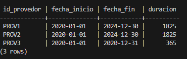


### Consulta 5

Para comprobar que funciona correctamente el trigger he probado a realizar un envío:

```sql
INSERT INTO Envios (id_proveedor, id_tienda, productos, fecha, cantidades) VALUES ('PROV3', 'TIENDA2', ARRAY['PMOU1'], '2020-01-01', ARRAY[20]);
```

Como podemos observar no ha sido posible ya que no estamos dentro de la fecha. Se puede ver en el apartado anterior que el contrato del PROV3 finalizó el 31-12-2020.

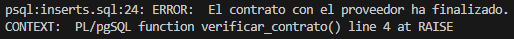

### Consulta 6

```sql
INSERT INTO Trabaja (id_tienda, id_empleado, cargo, fecha_inicio, duracion) VALUES ('TIENDA2', 99999998, 'Cajero', '2020-05-01', 365);
```

Error obtenido al tratar de hacer que un trabajador esté en dos tiendas al mismo tiempo:


### Consulta 7

Tiendas, al eliminar una tienda se observa como toda la información asociada desaparece:

```sql
DELETE FROM TIENDA WHERE id_tienda = 'TIENDA2';
```

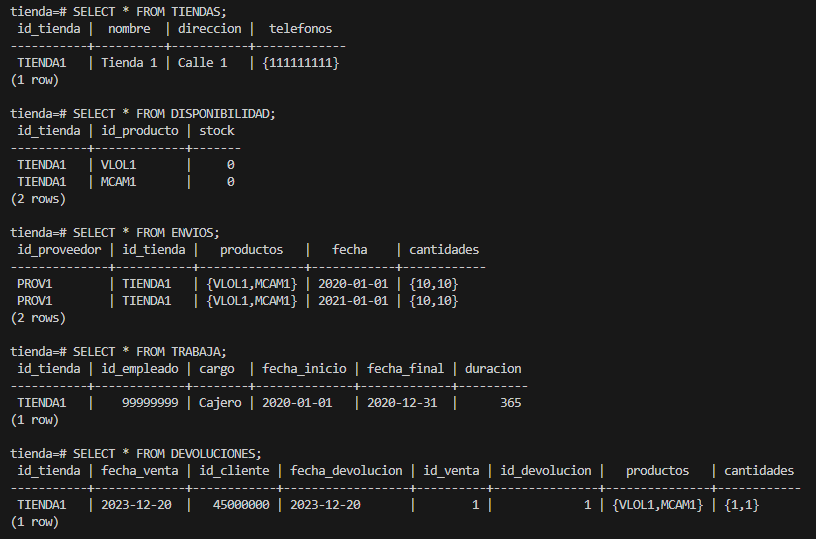

### Consulta 8

Proveedores, al eliminar un proveedor se observa como toda la información asociada desaparece:

```sql
DELETE FROM PROVEEDORES WHERE id_proveedor = 'PROV1';
```

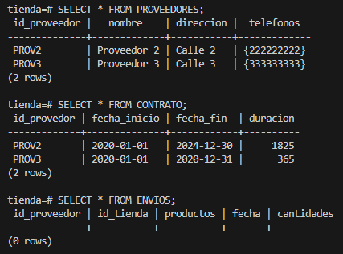

### Consulta 9

Salario

```sql
-- salario NUMERIC(10,2) CHECK (salario >= 1000) NOT NULL
INSERT INTO Empleados (id_empleado, nombre, apellidos, salario) VALUES (99999997, 'Empleado 3', 'Apellido 1', 999);
```

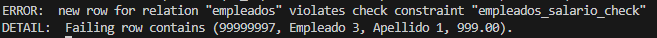

### Consulta 10

Fecha

```sql
--   fecha_inicio DATE CHECK (fecha_inicio >= DATE '2000-01-01') NOT NULL
INSERT INTO Proveedores (id_proveedor, nombre, direccion, telefonos) VALUES ('PROV4', 'Proveedor 4', 'Calle 4', ARRAY['444444444']);

INSERT INTO Contrato (id_provedor, fecha_inicio, duracion) VALUES ('PROV4', '1999-12-31', 365*5);
```

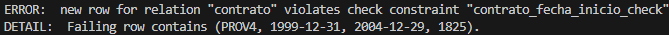

